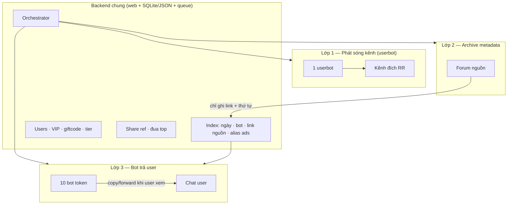
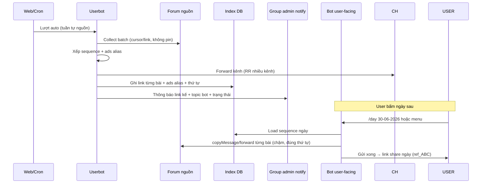

# Kiến trúc tổng thể

## Ba lớp tách ON/OFF

| Lớp | Bật/tắt web | Mô tả |
|-----|-------------|--------|
| Up kênh | `publish_channels` | Userbot forward — **độc lập** archive |
| Archive index | `archive_index` | Lưu link msg nguồn + metadata ngày — **không** forward vào forum backup |
| Bot delivery | `bot_delivery` | Bot copy ra user khi bấm ngày / tìm bộ / share link |

Thứ tự mặc định: **kênh trước → bot sau** (đổi được trên web).

---

## Forum & bot mapping

| Thực thể | Quy tắc |
|----------|---------|
| Forum nguồn | 1+ nguồn topic (ads / plain tách) |
| Forum backup metadata | **Chung** — không chứa media, chỉ index (optional topic admin log) |
| Forum quản lý admin | Duyệt tên bộ, ZIP backup, broadcast, ads alias |
| **1 bot token** | **1 topic cố định** trong catalog bot (map vĩnh viễn, tool không tự tìm) |
| Ngày VN | Topic tên `30-06-2026` **trên mỗi bot** (1 bot = 1 topic/ngày) |

Sau **30 ngày**: gom metadata vào **topic tổng** (text mục lục), **không xóa** text cũ — user vẫn tra index.

---

## Luồng 1 ngày (VN 00:00–23:59)

**1 lượt/ngày** (mặc định); config cho phép 2 lượt sau này.

**Idempotent**: bài đã ghi `delivered_to_channel` / `indexed` không up lại — retry an toàn.

---

## Đóng ngày (định nghĩa — C11)

Nút web **「Đóng ngày」**:

1. Khóa thêm bài vào `day_id` hôm nay.
2. Chạy `recheck_ads_aliases` (alias ads có đổi bài không).
3. Đánh dấu `status=published` → bot được phép trả user.
4. (Tuỳ chọn) ZIP backup lên topic admin.

---

## Group thông báo admin (thay pin nguồn)

Mỗi lượt auto gửi 1 tin:

- Bot / nguồn / ngày
- Link msg **kế tiếp** trên forum nguồn (cho lần sau)
- Deep link bot + tên topic ngày
- Trạng thái kênh (OK / fail / flood chờ)

**Không ghim** trên forum nguồn nữa.

---

## Plain (Up bài)

- Forum nguồn / bot / web menu **tách** Ads.
- **Cùng** user DB, VIP, Stars, giftcode (đồng bộ web ↔ tele).

---

## Broadcast (J43 mở rộng)

| Loại | Hành vi |
|------|---------|
| VIP media broadcast | Admin chọn batch → gửi tuần tự 1s/bài → hết hỏi **Done?** |
| All-user broadcast | Giống trên, filter tier / VIP |

User bị ban spam (E18): chỉ xem theo lịch up hoặc admin broadcast.
